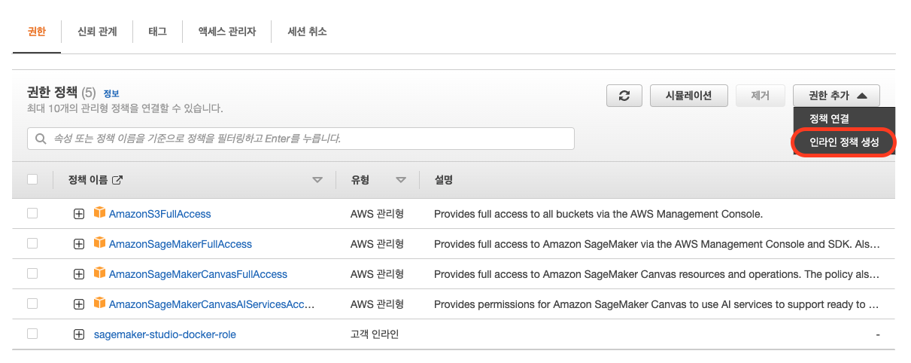

# Prerequisites


Lab5. Build MLOps pipeline using custom model 을 진행하는 경우 , 학습 및 배포에 사용할 커스텀 이미지를 생성해야 합니다. Lab#에서는 사용자 지정 이미지를 생성하기 위해 Sagemaker Studio Image Build CLI를 사용하여 Studio 노트북에서 도커 컨테이너를 빌드하여 사용자 지정 컨테이너 이미지를 생성 합니다.


CLI를 사용하기 위해서는 Studio 노트북 환경에서 사용하는 Amazon Sagemaker 실행 역할 혹은 다른 AWS IAM에 Codebuild 및 Amazon ECR 액세스를 비롯하여 CLI에서 사용하는 리소스와 상호 작용하는 데 필요한 권한을 부여해야 합니다.

1. 역할에 Codebuild와 신뢰 정책이 있어야 합니다. 아래 신뢰 정책 복사합니다.

```
{
  "Version": "2012-10-17",
  "Statement": [
    {
      "Effect": "Allow",
      "Principal": {
        "Service": [
          "codebuild.amazonaws.com"
        ]
      },
      "Action": "sts:AssumeRole"
    }
  ]
}
```

2. Sagemaker - 도메인 - 사용하는 도메인 클릭 - 도메인 설정 탭에 접근하여 도메인에 연결된 실행 역할을 복사합니다.

<figure><figcaption></figcaption></figure>

<figure><figcaption></figcaption></figure>

3. IAM - 역할 - 복사한 역할 클릭 - 신뢰관계 탭 클릭 - 신뢰 정책 편집 클릭 후 위에서 복사한 신뢰 정책을 입력합니다.

<figure><figcaption></figcaption></figure>

4. 또한 Codebuild의 Build 실행 / ECR의 리포지토리 생성 및 이미지 푸시를 위해 적절한 사용 권한을 역할에 추가해야 합니다. 권한 탭으로 이동하여 권한 추가 - 인라인 정책 생성을 클릭합니다.

<figure><figcaption></figcaption></figure>

5. 아래 정책을 복사합니다.

```
{
    "Version": "2012-10-17",
    "Statement": [
        {
            "Effect": "Allow",
            "Action": [
                "codebuild:DeleteProject",
                "codebuild:CreateProject",
                "codebuild:BatchGetBuilds",
                "codebuild:StartBuild"
            ],
            "Resource": "arn:aws:codebuild:*:*:project/sagemaker-studio*"
        },
        {
            "Effect": "Allow",
            "Action": "logs:CreateLogStream",
            "Resource": "arn:aws:logs:*:*:log-group:/aws/codebuild/sagemaker-studio*"
        },
        {
            "Effect": "Allow",
            "Action": [
                "logs:GetLogEvents",
                "logs:PutLogEvents"
            ],
            "Resource": "arn:aws:logs:*:*:log-group:/aws/codebuild/sagemaker-studio*:log-stream:*"
        },
        {
            "Effect": "Allow",
            "Action": "logs:CreateLogGroup",
            "Resource": "*"
        },
        {
            "Effect": "Allow",
            "Action": [
                "ecr:CreateRepository",
                "ecr:BatchGetImage",
                "ecr:CompleteLayerUpload",
                "ecr:DescribeImages",
                "ecr:DescribeRepositories",
                "ecr:UploadLayerPart",
                "ecr:ListImages",
                "ecr:InitiateLayerUpload",
                "ecr:BatchCheckLayerAvailability",
                "ecr:PutImage"
            ],
            "Resource": "arn:aws:ecr:*:*:repository/sagemaker-studio*"
        },
        {
            "Effect": "Allow",
            "Action": "ecr:GetAuthorizationToken",
            "Resource": "*"
        },
        {
            "Effect": "Allow",
            "Action": [
              "s3:GetObject",
              "s3:DeleteObject",
              "s3:PutObject"
              ],
            "Resource": "arn:aws:s3:::sagemaker-*/*"
        },
        {
            "Effect": "Allow",
            "Action": [
                "s3:CreateBucket"
            ],
            "Resource": "arn:aws:s3:::sagemaker*"
        },
        {
            "Effect": "Allow",
            "Action": [
                "iam:GetRole",
                "iam:ListRoles"
            ],
            "Resource": "*"
        },
        {
            "Effect": "Allow",
            "Action": "iam:PassRole",
            "Resource": "arn:aws:iam::*:role/*",
            "Condition": {
                "StringLikeIfExists": {
                    "iam:PassedToService": "codebuild.amazonaws.com"
                }
            }
        }
    ]
}
```

6. JSON 탭 클릭 후 복사한 정책을 입력 후 정책 검토를 클릭합니다.
7. 입력한 사용 권한을 확인 후 정책의 적절한 이름을 입력합니다.

<figure><figcaption></figcaption></figure>

8. 정책 생성 버튼을 누르고 정책이 잘 연결되어 있는지 확인합니다.

<figure><figcaption></figcaption></figure>

9. 마지막으로 ECR에 업로드한 컨테이너 이미지를 사용하기 위한 정책을 역할에 추가합니다.

```
{
    "Version": "2012-10-17",
    "Statement": [
        {
            "Effect": "Allow",
            "Action": "iam:PassRole",
            "Resource": "*",
            "Condition": {
                "StringEquals": {
                    "iam:PassedToService": [
                        "sagemaker.amazonaws.com"
                    ]
                }
            }
        },
        {
            "Effect": "Allow",
            "Action": [
                "ecr:ListTagsForResource",
                "ecr:ListImages",
                "ecr:DescribeRepositories",
                "ecr:BatchCheckLayerAvailability",
                "ecr:GetLifecyclePolicy",
                "ecr:DescribeImageScanFindings",
                "ecr:GetLifecyclePolicyPreview",
                "ecr:GetDownloadUrlForLayer",
                "ecr:BatchGetImage",
                "ecr:DescribeImages",
                "ecr:GetRepositoryPolicy"
            ],
            "Resource": [
                "*"
            ]
        }
    ]
}
```


위 설정을 통해 Sagemaker Studio에서 커스텀 도커 이미지를 빌드하고, 생성할 수 있습니다.


