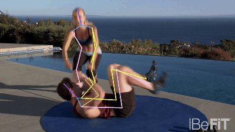
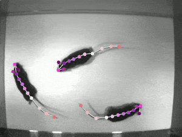

# Pose Estimation

Pose Estimation은 객체를 구성하는 Keypoint의 위치를 추정하며, 컴퓨터비전 분야에서 기본이 되는 Keypoint Detection 이라고 할 수 있습니다. 주로 사람의 자세를 추정하는 모델들이 개발되어 왔으나, 동물, 자동차(사물) 등의 자세를 추정하기 위한 모델들도 개발되어 있습니다.&#x20;

.png>)

사람의 자세 추정은 주로 사람의 관절(머리, 목, 어깨, 허리, 엉덩이, 무릎 등) 또는 특징(눈, 코, 입 등) 정보를 사용하며, 보편적인 Human Pose Estimation은 17개의 서로 다른 Keypoint를 감지하게 됩니다.

<figure><figcaption></figcaption></figure>

포즈 추정을 위해 다양한 모델들이 개발 및 사용되고 있는데, OpenPose, PoseNet, Yolo-pose, Mediapipe pose 등의 모델들은 다양한 ML 프레임워크, 알고리즘으로 구성되어 있으며, 모델 별로 Sagemaker에서 기본으로 제공하는 컨테이너 이미지를 통해 학습 및 배포가 가능한 경우도 있으나, 로직 및 종속성으로 인해 사용자 지정 컨테이너 이미지를 생성하여 사용해야 하는 경우가 있습니다.

YOLOv8은 2023년 1월에 Ultralytics에서 출시한 모델입니다. YOLO 모델을 위한 완전히 새로운 패키지를 출시하여 객체 감지, 객체 분할, 이미지 분류 등 다양한 Vision AI 모델을 학습하기 위한 통합 프레임워크로 개발되었습니다. YOLO 모델은 초기 버전부터 빠른 속도와 정확도로 많은 인기를 가지고 있는 모델이며 오픈소스로 많은 분야에 활용되고 있습니다.

<figure><figcaption>
YOLOv8 - <a href="https://github.com/ultralytics/ultralytics/issues/189">https://github.com/ultralytics/ultralytics/issues/189</a>
</figcaption></figure>


이번 Lab은 두 가지 시나리오 중 한가지를 선택하여 진행할 수 있습니다.


#### 학습 없이 Pretrained Model을 배포하고 테스트를 진행하는 경우 아래 링크로 이동합니다.


[hosting-yolov8-pytorch-model.md](../group-2/deploy-sagemaker-endpoint-with-pretrained-model/hosting-yolov8-pytorch-model.md)


#### MLOps를 구성하여 학습 및 배포 파이프라인 실습을 진행하고, 배포한 모델의 엔드포인트를 이용하여 테스트하는 경우 아래 링크로 이동합니다.


[undefined.md](../group-3/build-sagemaker-pipeline-with-custom-docker/undefined.md)

